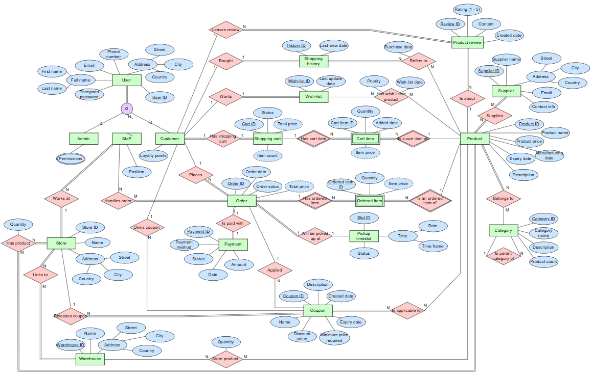

# quick-buy
Semester 251 major assignment of Database system course at HCMUT
# QuickBuyDB - E-Commerce Database

## 📌 Project Overview
**QuickBuyDB** is a complete, ready-to-use relational database built for an online e-commerce store. It manages everything from users and product catalogs to shopping carts, multiple store locations, warehouses, and order tracking.

More than just creating tables, this project shows how to use advanced SQL to automate tasks, keep data clean, and enforce business rules directly inside the database.

---

## 🚀 Key Highlights for Data Engineering

### 1. Smart Database Design (Data Modeling)
- **29 Connected Tables:** Carefully designed to reflect real-world business needs, including supply chains and customer orders.
- **Handling Complex Relationships:** Used bridge tables to easily link products to multiple stores, categories, and warehouses without creating duplicate data.

### 2. Built-in Automations (Triggers)
Instead of relying on backend code to do all the math, the database handles it automatically to ensure 100% accuracy:
- **Auto-Calculating Totals:** Triggers automatically update the `TotalPrice` and `ItemCount` in shopping carts and orders whenever items are added, updated, or removed.
- **Loyalty Points System:** Automatically gives customers reward points when their order status changes to 'Completed'.
- **Auto-Cancellation:** Automatically cancels pending orders if the customer hasn't paid within 24 hours.

### 3. Keeping Data Clean and Safe (Constraints)
A good database never accepts bad data. I used strict rules to protect data quality:
- **Regex Password Checking:** Enforces strong passwords (must contain uppercase, numbers, and special characters) directly at the database level.
- **Smart Data Rules:** Ensures prices are never lower than wholesale costs, time slots make logical sense (End Time > Start Time), and stock levels are never negative.
- **Real-Time Stock Checking:** Automatically stops an order from processing if a store doesn't have enough items in stock.

### 4. Ready-to-Test Data
- The database comes fully loaded with sample stores, users, products, and orders. 
- You can easily run tests, check how triggers work, and see the database in action right away.

---

## 🛠️ Tech Stack & Skills Used
- **Database:** MySQL 
- **Key Skills:** Database Design, Table Relationships, Triggers, Data Constraints (CHECK, FOREIGN KEY), Data Validation (Regex), SQL Error Handling.

